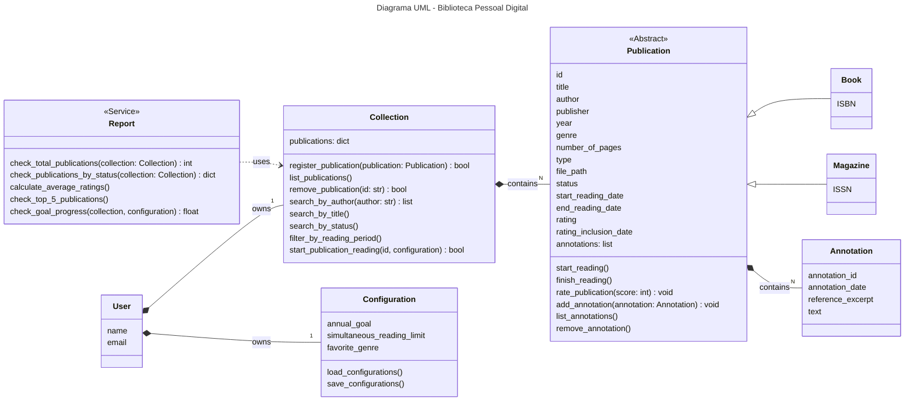

# Projeto - Biblioteca Pessoal Digital

Atividade prática da disciplina de Programação Orientada à Objetos (ES0008) para composição parcial de nota.

## Descrição

Este projeto visa desenvolver um sistema de biblioteca digital que funcione a partir de linha de comando ou através de uma API simples, de forma a aprender e praticar a Programação Orientada à Objetos.

## Estrutura de Classes

Inicialmente, o projeto está dividido nas seguintes classes:

### User

Representa o dono da biblioteca. É a classe raiz que possui `Collection`, de forma pessoal, e `Configuration`, de forma individual, por composição.
Apresenta como atributos `name` e `email`.

### Collection

Gerencia o acervo completo de publicações do usuário. É responsável por adicionar, remover e buscar publicações em sua lista.
Apresenta como atributo `publications`, como dicionário.
Possui como métodos principais `register_publication()`, `list_publications()`, `remove_publication()`, `search_by_author()`, `search_by_title()`, entre outros.
Apresenta relação de composição com a classe `Publication` e é possuída por `User`.

### Publication

Contém todas as informações e regras de negócio pertinentes à cada obra. É responsável por gerenciar seu próprio estado interno.
Tem como atributos `title`, `author`, `year`, `genre`, `status`, `start_reading_date`, `rating`, dentre outros.
Seus métodos principais são `start_reading()`, `finish_reading()`, `rate_publication()`, `add_annotation()`, entre outros.
Possui relação de composição com a classe `Annotation` e é possuída por `Collection`.

#### Book

É especialização de Publication.
Apresenta como atributo o `ISBN`.

#### DigitalMagazine

É especialização de Publication.
Apresenta como atributo o `ISSN`.

### Annotation

Representa um registro de texto associado a uma publicação. Seu ciclo de vida depende 100% da publicação que está associada.
Seus atributos são `annotation_date`, `reference_excerpt` e `text`.
É possuída por `Publication`.

### Configuration

Armazena as preferências e metas do usuário, facilitando o carregamento e salvamento a partir de um `settings.json`.
Tem como atributos `annual_goal`, `simultaneous_reading_limit` e `favorite_genre`.
Seus métodos são `load_configurations()` e `save_configurations()`.
É possuído por `User`.

### Report

Classe de serviço stateless responsável por processar dados e gerar métricas.
Seus métodos são `check_total_publications()`, `check_publications_by_status()`, dentre outros.
Depende de `Collection` para receber os dados, mas não a armazena.

## Diagrama UML

