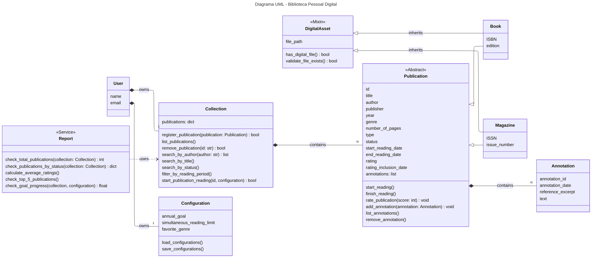

# Projeto - Biblioteca Pessoal Digital

Atividade prática da disciplina de Programação Orientada à Objetos (ES0008) para composição parcial de nota.

## Descrição

Este projeto visa desenvolver um sistema de biblioteca digital que funcione a partir de linha de comando ou através de uma API simples, de forma a aprender e praticar a Programação Orientada à Objetos.

## Estrutura do Projeto

O projeto segue uma organização modular e bem definida, separando responsabilidades em diferentes diretórios:

```text
biblioteca_pessoal_digital/
├── docs/                          # Documentação complementar
│   └── uml.md                     # Diagramas UML detalhados
├── src/                           # Código fonte principal
│   ├── __init__.py
│   ├── api/                       # Camada de API REST
│   │   └── __init__.py
│   ├── cli/                       # Interface de linha de comando
│   │   ├── __init__.py
│   │   └── main.py                # Ponto de entrada da aplicação CLI
│   ├── data/                      # Camada de persistência de dados
│   │   ├── __init__.py
│   │   ├── database.py            # Gerenciamento de banco de dados
│   │   └── repository.py          # Padrão Repository para acesso aos dados
│   └── models/                    # Modelos de domínio (classes principais)
│       ├── __init__.py
│       ├── annotation.py          # Classe Annotation
│       ├── collection.py          # Classe Collection
│       ├── configuration.py       # Classe Configuration
│       ├── publication.py         # Classes Publication, Book e Magazine
│       ├── report.py              # Classe Report
│       └── user.py                # Classe User
├── tests/                         # Testes unitários e de integração
│   └── __init__.py
├── .gitignore                     # Arquivos ignorados pelo Git
├── README.md                      # Documentação e instruções de execução
├── requirements.txt               # Dependências do projeto
└── settings.json                  # Arquivo de configurações do usuário
```

### Descrição dos Diretórios

- **`docs/`**: Contém documentação adicional do projeto, incluindo diagramas UML e especificações técnicas.
- **`src/`**: Diretório principal do código fonte, organizado em módulos específicos:
  - **`api/`**: Implementação da interface REST API para acesso externo ao sistema.
  - **`cli/`**: Interface de linha de comando, principal forma de interação com o usuário.
  - **`data/`**: Responsável pela persistência e recuperação de dados, implementando o padrão Repository.
  - **`models/`**: Contém todas as classes de domínio que representam as entidades do sistema.
- **`tests/`**: Suite de testes para garantir a qualidade e funcionamento correto do código.

### Arquivos de Configuração

- **`requirements.txt`**: Lista todas as dependências Python necessárias para o projeto.
- **`settings.json`**: Armazena as configurações personalizadas do usuário (metas, preferências, etc.).
- **`.gitignore`**: Define quais arquivos e diretórios devem ser ignorados pelo controle de versão.

## Estrutura de Classes

Inicialmente, o projeto está dividido nas seguintes classes:

### User

Representa o dono da biblioteca. É a classe raiz que possui `Collection`, de forma pessoal, e `Configuration`, de forma individual, por composição.
Apresenta como atributos `name` e `email`.

### Collection

Gerencia o acervo completo de publicações do usuário. É responsável por adicionar, remover e buscar publicações em sua lista.
Apresenta como atributo `publications`, como dicionário.
Possui como métodos principais `register_publication()`, `list_publications()`, `remove_publication()`, `search_by_author()`, `search_by_title()`, entre outros.
Apresenta relação de composição com a classe `Publication` e é possuída por `User`.

### Publication

Contém todas as informações e regras de negócio pertinentes à cada obra. É responsável por gerenciar seu próprio estado interno.
Tem como atributos `title`, `author`, `year`, `genre`, `status`, `start_reading_date`, `rating`, dentre outros.
Seus métodos principais são `start_reading()`, `finish_reading()`, `rate_publication()`, `add_annotation()`, entre outros.
Possui relação de composição com a classe `Annotation` e é possuída por `Collection`.

#### Book

É especialização de Publication e herda de DigitalAsset (Mixin).
Apresenta como atributos `ISBN` e `edition`.

#### Magazine

É especialização de Publication e herda de DigitalAsset (Mixin).
Apresenta como atributos `ISSN` e `issue_number`.

### Annotation

Representa um registro de texto associado a uma publicação. Seu ciclo de vida depende 100% da publicação que está associada.
Seus atributos são `annotation_date`, `reference_excerpt` e `text`.
É possuída por `Publication`.

### DigitalAsset (Mixin)

Define um conjunto de funcionalidades para classes que representam ativos digitais, como a gestão do caminho do arquivo (`file_path`).
É um mixin utilizado por classes de publicação digital (`Book` e `Magazine`) através de herança múltipla.
Apresenta como atributos `file_path` (o caminho do arquivo).
Seus métodos principais são `has_digital_file()` e `validate_file_exists()`.

### Configuration

Armazena as preferências e metas do usuário, facilitando o carregamento e salvamento a partir de um `settings.json`.
Tem como atributos `annual_goal`, `simultaneous_reading_limit` e `favorite_genre`.
Seus métodos são `load_configurations()` e `save_configurations()`.
É possuído por `User`.

### Report

Classe de serviço stateless responsável por processar dados e gerar métricas.
Seus métodos são `check_total_publications()`, `check_publications_by_status()`, dentre outros.
Depende de `Collection` para receber os dados, mas não a armazena.

## Diagrama UML


