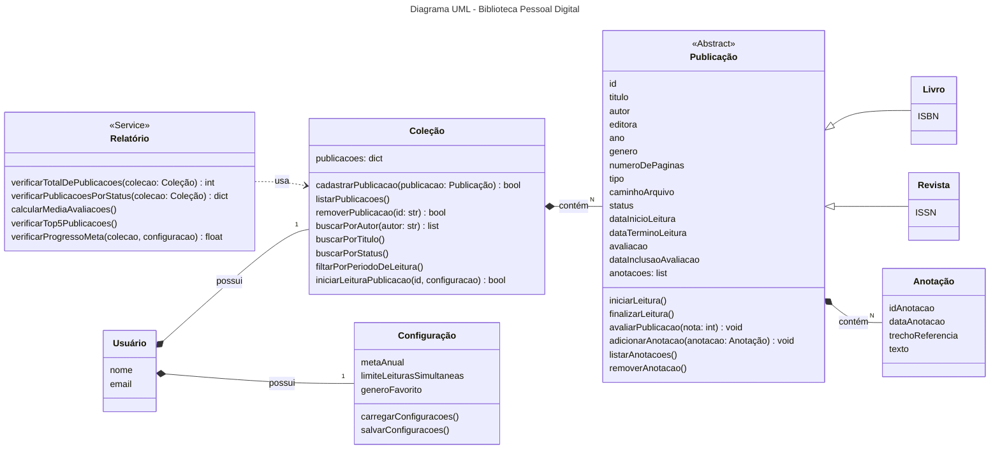

# Projeto - Biblioteca Pessoal Digital

Atividade prática da disciplina de Programação Orientada à Objetos (ES0008) para composição parcial de nota.

# Descrição

Este projeto visa desenvolver um sistema de biblioteca digital que funcione a partir de linha de comando ou através de uma API simples, de forma a aprender e praticar a Programação Orientada à Objetos.

# Estrutura de Classes

Inicialmente, o projeto está dividido nas seguintes classes:

## Usuário

Representa o dono da biblioteca. É a classe raiz que possui `Coleção`, de forma pessoal, e `Configuração`, de forma individual, por composição.
Apresenta como atributos `nome` e `email`.

## Coleção

Gerencia o acervo completo de publicações do usuário. É responsável por adicionar, remover e buscar publicações em sua lista.
Apresenta como atributo `publicacoes`, como dicionário.
Possui como métodos principais `cadastrarPublicacao()`, `listarPublicacoes()`, `removerPublicacao()`, `buscarPorAutor()`, `buscarPorTitulo()`, entre outros.
Apresenta relação de composição com a classe `Publicação` e é possuída por `Usuário`.

## Publicação

Contém todas as informações e regras de negócio pertinentes à cada obra. É responsável por gerenciar seu próprio estado interno.
Tem como atributos `titulo`, `autor`, `ano`, `genero`, `status`, `dataInicioLeitura`, `avaliacao`, dentre outros.
Seus métodos principais são `iniciarLeitura()`, `finalizarLeitura()`, `avaliarPublicacao()`, `adicionarAnotacao()`, entre outros.
Possui relação de composição com a classe `Anotacao` e é possuído por `Coleção`.

### Livro

É especialização de Publicação.
Apresenta como atributo o `ISBN`.

### Revista Digital

É especialização de Publicação.
Apresenta como atributo o `ISSN`.

## Anotação

Representa um registro de texto associado a uma publicação. Seu ciclo de vida depende 100% da publicação que está associada.
Seus atributos são `dataAnotacao`, `trechoReferencia` e `texto`.
É possuída por `Publicação`.

## Configuração

Armazena as preferências e metas do usuário, facilitando o carregamento e salvamento a partir de um `settings.json`.
Tem como atributos `metaAnual`, `limiteLeiturasSimultaneas` e `generoFavorito`.
Seus métodos são `carregar()` e `salvar()`.
É possuído por `Usuário`.

## Relatório

Classe de serviço stateless responsável por processar dados e gerar métricas.
Seus métodos são `verificarTotalDePublicacoes()`, `verificarPublicacoesPorStatus()`, dentre outros.
Depende de `Coleção` para receber os dados, mas não a armazena.

# Diagrama UML

