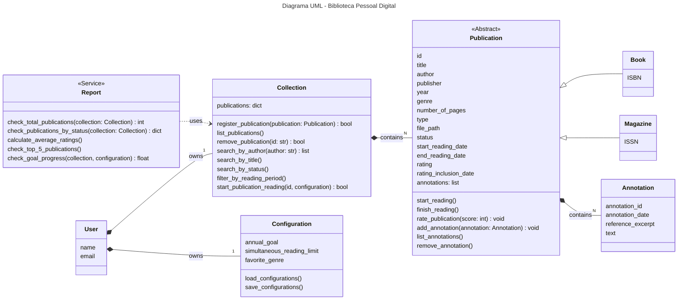

```mermaid
---
title: Diagrama UML - Biblioteca Pessoal Digital
---
classDiagram
	direction LR
	
	`Collection` *-- "N" `Publication` : contains
	`Publication` <|-- Book
	`Publication` <|-- Magazine
	`Publication` *-- "N" `Annotation` : contains
	`User` *-- "1" `Collection` : owns
	`User` *-- "1" `Configuration` : owns
	`Report` ..> `Collection` : uses

	class `Collection`{
		publications: dict
		register_publication(publication: Publication) bool
		list_publications()
		remove_publication(id: str) bool
		search_by_author(author: str) list
		search_by_title()
		search_by_status()
		filter_by_reading_period()
	    start_publication_reading(id, configuration) bool
	}
	
	class `Publication` {
		<<Abstract>>
		id
		title
		author
		publisher
		year
		genre
		number_of_pages
		type
		file_path
		status
		start_reading_date
		end_reading_date
		rating
		rating_inclusion_date
	    annotations: list
		start_reading()
		finish_reading()
		rate_publication(score: int) void
		add_annotation(annotation: Annotation) void
		list_annotations()
		remove_annotation()
	}
	
	class Book{
		ISBN
	}
	
	class Magazine{
		ISSN
	}
	
	class `Annotation`{
		annotation_id
		annotation_date
		reference_excerpt
		text
	}
	
	class `Report` {
		<<Service>>
		check_total_publications(collection: Collection) int
		check_publications_by_status(collection: Collection) dict
		calculate_average_ratings()
		check_top_5_publications()
	    check_goal_progress(collection, configuration) float
	}
	
	class `User` {
		name
		email
	}
	
	class `Configuration` {
		annual_goal
		simultaneous_reading_limit
		favorite_genre
		load_configurations()
		save_configurations()
	}

```